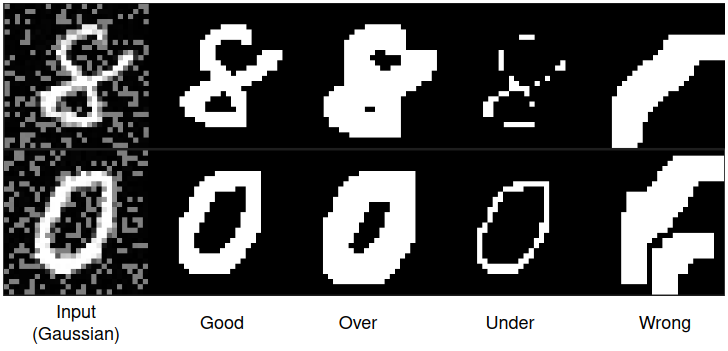
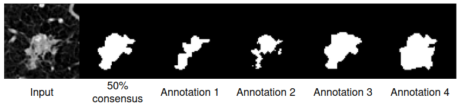
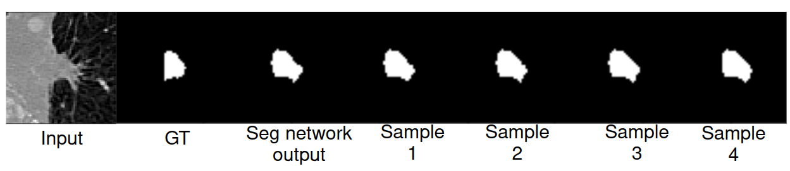
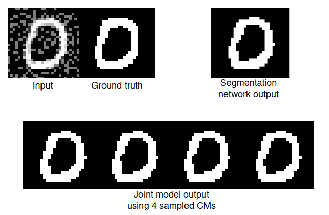

# A Probabilistic Deep Learning Approach to Reconstructing Ground Truths in Medical Image Segmentation #

## Introduction ## 
This repo holds code for my MSc thesis. I provide a joint CNN-VAE model which simultaneously learns a ground truth from noisy labels only and confusion matrices to model and remove annotator noise from an aggregation of all input noisy labels. The VAE part of our model allows us to generate different confusion matrices indefinitely. For a binary segmentation task

### data ### 

We use MNIST and LIDC-IDRI datasets generated from the scripts found in /preprocessing. 

Morphological operations using OpenCV are used to generate synthetic annotator types in from the MNIST dataset.



LIDC-IDRI dataset is prepared using Prepare_LIDC.py. This requires the user to download the data from the official LIDC-IDRI website. 

[LIDC-IDRI](https://wiki.cancerimagingarchive.net/display/Public/LIDC-IDRI "Main webpage of LIDC-IDRI dataset")

Below is an example of the LIDC data.



Use the correct file path to your LIDC download then run Prepare_LIDC.py. 

### Requirements ###
Packages can be found in exported environment.yml file.

## Model Structure ##
.png)

## How to run ## 
Use Run.py to run both probabilistuc unet and our model

## Repo structure ##

Legacy code folder contains unused legacy code from previous work by Moucheng Xu. Found at:
[Old repo](https://github.com/moucheng2017/Learn_Noisy_Labels_Medical_Images)

[Mou-Cheng Xu](https://moucheng2017.github.io/) is the developer of the legacy code. From paper below:

```
@article{HumanError2020,
  title={Disentangling Human Error from the Ground Truth in Segmentation of Medical Images},
  author={Zhang, Le and Tanno, Ryutaro and Xu, Mou-Cheng and Jacob, Joseph and Ciccarelli, Olga and Barkhof, Frederik and C. Alexander, Daniel},
  journal={NeurIPS},
  year={2020},
}
```

```bash
├── adamW.py
├── hyperparam-optim    # hyperparameter search
│   ├── hyper-optim-deterministic.ipynb 
│   └── hyper-optim-stochastic.ipynb    # for our proposed model
├── image-analysis.ipynb    # lidc image analysis
├── Legacy-code
├── LIDC_examples  
│   ├── meta
│   │   └── metadata.csv    # metadata of lidc data
│   ├── test
│   │   ├── masks   # binary masks with noisy annotation labels
│   │   └── scans   # cropped normalised CT scans
│   ├── train
│   │   ├── masks
│   │   └── scans
│   └── validate
│       ├── masks
│       └── scans
├── MNIST_examples
│   ├── test
│   │   ├── Gaussian    # input labels
│   │   ├── GT          # Noisy labels (good-segmentation)
│   │   ├── Over        # Noisy labels (over-segmented)
│   │   ├── Under       # Noisy labels (under-segmented)
│   │   └── Wrong       # Noisy labels (wrong-segmentation)
│   ├── train
│   │   ├── All # all label types (manually created)
│   │   ├── Gaussian
│   │   ├── GT
│   │   ├── Over
│   │   ├── Under
│   │   └── Wrong
│   └── validate
│       ├── Gaussian
│       ├── GT
│       ├── Over
│       ├── Under
│       └── Wrong
├── Models.py   # contains probabilistic unet model
├── preprocessing   # used for generating our datasets
│   ├── Prepare_LIDC.py
│   └── Prepare_MNIST.py
├── README.md
├── Run.py  # main hub to run all models 
├── Stochastic_CM.py    # our proposed model
├── Stochastic_LIDC.py  # example script for training LIDC
├── Stochastic_Loss.py  # proposed loss function 
├── Stochastic_MNIST.py # example script for training MNIST
├── Train_punet.py  # script for probabilstic unet
├── Train_VAE.py    # script for our proposed model
├── Utilis.py       # contains main functions for training
└── environment.yml # conda environment file containing package requirements and dependencies
```
## hyperparameter search
We also provide a hyperprameter search scheme using optuna nad mlflow for tracking in hyperparam-optim folder.

## Example qualitative results

LIDC


MNIST

